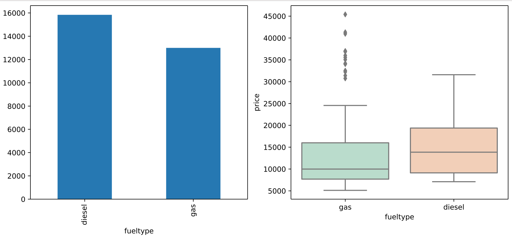
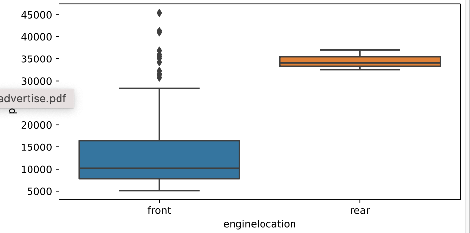
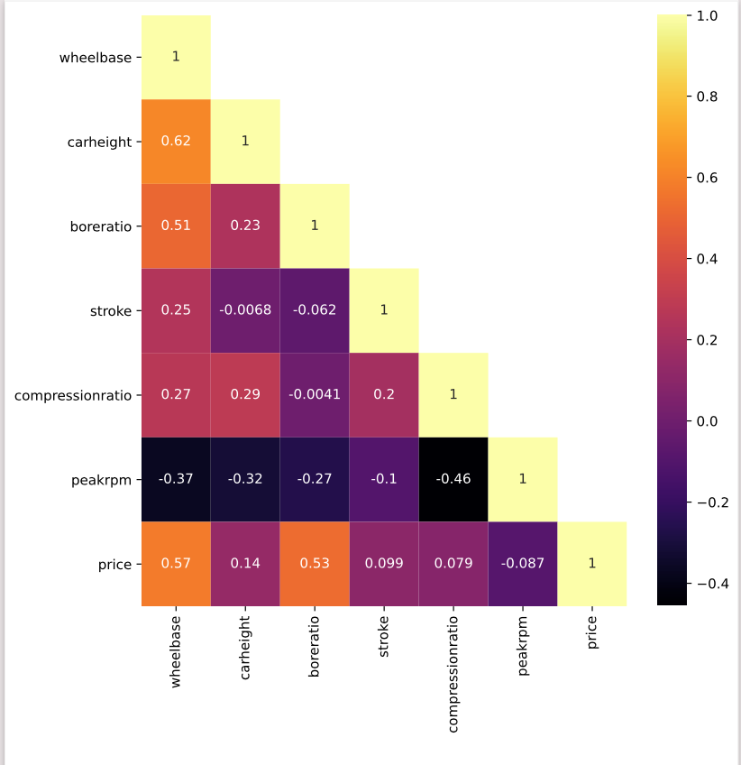

# Car price prediction using regression techniques

## Problem Definition
The task was to find a dataset and analyze it by setting up some hypothesis and by using EDA techniques. Finally, features had to be selected based on these results of a model had to be made. 

## Methodology
* description of the data
* set hypothesis and conduct EDA
* preprocess the data
* build regression models on the processed data
* compare the different models using mlflow

Some of the features present in the data are described in the about.txt file.

```
Hypothesis : disel cars are costlier than cars that run on gas.
```


```
Hypothesis : engine location hugely affects the price.
```


## Features were removed such that independent features did not have high correlation between them. 



Out of all the features, car body, drive wheel and engine type are the most advertised features. So a model was made wsing only these features. 


