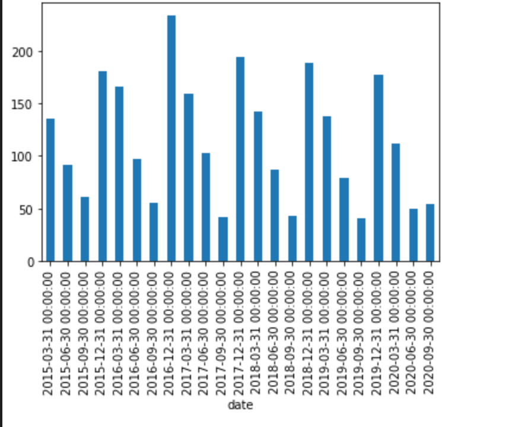
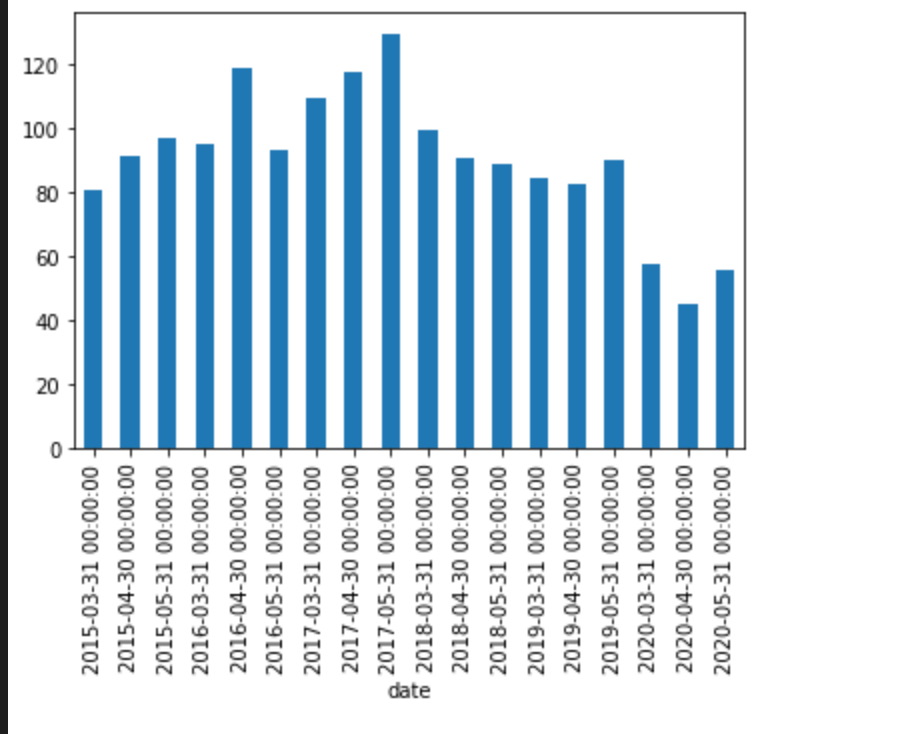
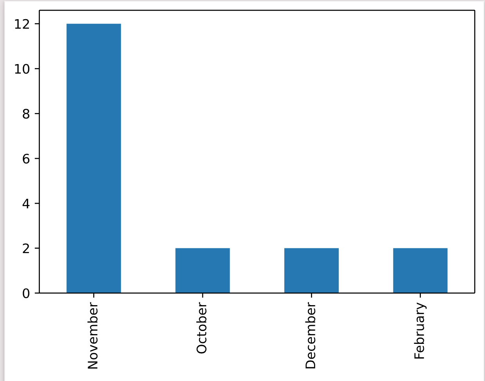

## Time Series Analysis of air quality of the city Delhi.
Based on the analysis, a couple of hypothesis were set, and they were tested accordingly. 

```
Hypothesis : The data shows both seasonality and trend
The chart showed that, while the data had seasonality, it did not have a trend.
````


```
Hypothesis : The pollution level rises during in the last quarter and declines in the third quarter.
```


You can read more about why pollution level rises in winter [here](https://www.accuweather.com/en/health-wellness/why-air-pollution-is-worse-in-winter/689434#:~:text=Cold%20air%20is%20denser%20and%20moves%20slower%20than%20warm%20air,rate%20than%20during%20the%20summer.)

```
Assumption : Pollution level fell in April 2020 - May 2020
```


This assumption was made because India enforced a nationwide lockdown from 25-03-2020 to 31-05-2020

```
Finding : In the month of November, pollution tends to spike up. The PM2.5 counter reads above 400!!
```


This spike is sometimes attributed to farmers from Punjab and Haryana who set their fields on fire to quickly clear off the crop residue left behind after harvesting paddy and before cultivating wheat and potato.

You can read more about why pollution level spikes in Delhi in November [here](https://www.nationalgeographic.com/environment/article/new-delhi-burning-season-makes-air-even-more-dangerous-can-anything-be-done)

The data can be analyzed to check how pollution level changes during weekends, holidays and festivals. 