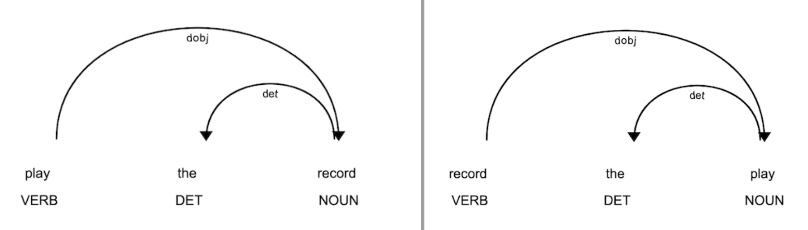

## Understanding text similarity

Finding text similarity has its own set of challenges. While the aim is to only find the similarity between sets of documents, the change in meaning of words with changing context and/or its [POS tag](https://en.wikipedia.org/wiki/Part-of-speech_tagging) makes it difficult to determine resemblance. 

Whenever we talk about text similarity, we have to mostly focus two levels.
```
On a lexical level : focuses on just the words and vocab of the language being processed
On a semantic level : the context and meaning of the words are also taken into account
```

Consider the following 



The two sentences seem identical, but they have different meaning. The challenege would be to understand the context and confirm that they do not have 100% similarity. Unfortunatuely, even the BERT model performs bad for this case.


You can read more about the different techniques of finding text similarity [here](https://medium.com/@adriensieg/text-similarities-da019229c894).

Here we have mostly dealt with Tfidf Vectorizer and the BERT model

The count vectorizer does not take into accout the semantic similarities between words and assumes that the counts of different words provide independent evidence of similarity. 

Consider the sentences :
```
My name is Roman
People call me Roman
```
The two sentences have the same meaning. However, since Tfidf only takes into account the word frequency, the similarity score between the two, using the Tfidf Vectorizer, is not as good as it should be. 


Fortunately, we have the BERT embedding technique that also takes into account the semantic meaning of words with its context.

For the same example above


The example shows how the BERT model performs better than the Tfidf Vectorizer in terms of finding sentence similarity by considering the context of the sentences as well.