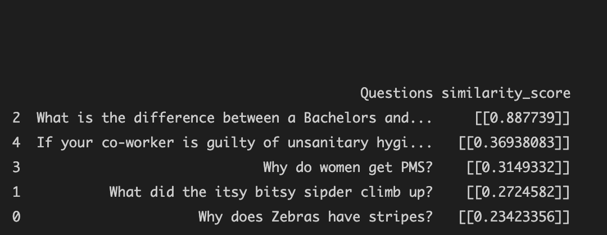

## Implementing text-similarity

Text similarity is widely used in search engines to process questions-and-answers. Websites such as Quora or Stackoverflow need to determine whether a question has already been asked before.

In this project, I have tried to do something very similar.

With a list of 2500 questions already asked on Yahoo, we check if any new question matches with the previous 2500 questions.

## Procedure
1. Embeddings of the questions were stored in a npy file.
2. The embedding of the new question asked is calculated.
3. cosine_similarity between the new question and previously asked question is calculated and the top 5 similar questions are shown as suggestions.

## Example

```
query = How is bachelors degree different from Master degree?
```

